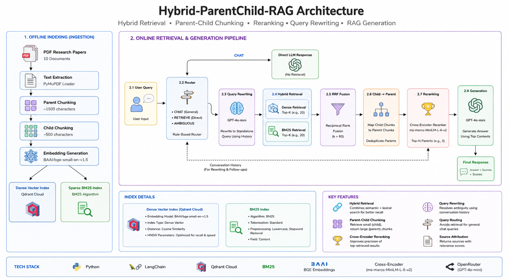
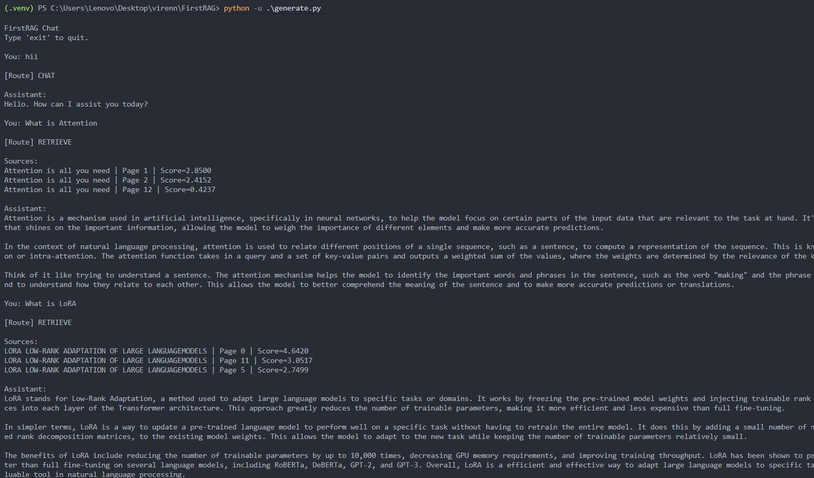
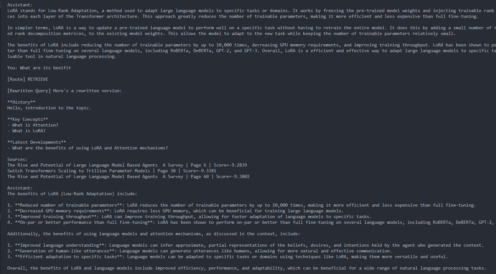

# Hybrid-ParentChild-RAG

# System Architecture




# Demo

## Retrieval Query



## Chat Query




# Quick Start

## Clone Repository

```bash
git clone https://github.com/VirensinIITBHU/Hybrid-ParentChild-RAG.git
cd Hybrid-ParentChild-RAG
```

## Create Virtual Environment

```bash
python -m venv .venv
```

Activate:

### Windows

```bash
.venv\Scripts\activate
```

### Linux / Mac

```bash
source .venv/bin/activate
```

---

## Install Dependencies

```bash
pip install -r requirements.txt
```

---

## Configure Environment Variables

Create a `.env` file in the project root:

```env
OPEN_ROUTER_KEY=your_openrouter_api_key

QDRANT_URL=your_qdrant_url
QDRANT_API_KEY=your_qdrant_api_key
```

---

## Add Research Papers

Place PDF documents inside:

```text
documents/
```

The project was tested on research papers such as:

* Attention Is All You Need
* DistilBERT
* GPT-3
* LoRA
* Switch Transformers

---

# Build the Knowledge Base

# Getting Started

The normal workflow is:

```text
1. Add PDFs
        ↓
2. Ingest Documents
        ↓
3. Generate Embeddings
        ↓
4. Chat / Retrieve
```

Evaluation is optional and only needed if you want to benchmark retrieval or answer quality.

---

# Step 1: Ingest Documents

```bash
python main.py --mode ingest
```

This step:

* Extracts text from PDFs
* Creates parent chunks
* Creates child chunks
* Stores chunk metadata

---

# Step 2: Generate Embeddings

```bash
python main.py --mode embed
```

This step:

* Generates dense embeddings
* Uploads vectors to Qdrant
* Builds the retrieval index

---

# Step 3: Start Chatting

```bash
python main.py --mode chat
```

At this point the system is fully usable.

You do **not** need benchmark generation or evaluation to use the chatbot.

---

# Optional: Evaluation

Evaluation is only required if you want to measure retrieval quality or compare retrieval strategies.

## Generate Benchmark Dataset

```bash
python creatingQues.py
```

The benchmark generation pipeline uses an LLM to create:

* Questions
* Ground-truth answers
* Question types
* Source chunk mappings
* Parent chunk mappings

### Important

If you re-run ingestion, chunk IDs may change.

In that case regenerate the benchmark:

```bash
python creatingQues.py
```

If you are evaluating the same indexed corpus, you can reuse the existing benchmark dataset and skip benchmark generation.

---

## Retrieval Evaluation

```bash
python main.py --mode eval
```

Evaluates:

* Dense Retrieval
* BM25 Retrieval
* Hybrid Retrieval
* Parent Recall@K

---

## RAG Evaluation

```bash
python main.py --mode ragas
```

Evaluates the complete pipeline using:

* Retrieval Recall
* Answer Similarity
* Faithfulness
* Context Precision


## Step 1: Ingest Documents

Run ingestion:
NOTE: Ingesting is optional you can use preloaded chunks.pkl if you want to use existing Benchmark suite
if so You can directly run **emmbed** command from step 2
```bash
python main.py --mode ingest
```

This step:

* Extracts text from PDFs
* Creates parent chunks
* Creates child chunks
* Stores processed chunks for retrieval

---

## Step 2: Generate Embeddings and Index Data

Run embedding generation:

```bash
python main.py --mode embed
```

This step:

* Converts chunks into dense vector embeddings
* Uploads vectors to Qdrant Cloud
* Builds the retrieval index used during search

---

# Running the System

## Chat Interface

Once ingestion and embedding generation are complete, start the chatbot:

```bash
python main.py --mode chat
```

Example:

```text
You: What is attention?

[Route] RETRIEVE

Sources:
Attention is all you need | Page 1
Attention is all you need | Page 2

Assistant:
Attention is a mechanism that allows a model to focus on relevant parts of the input...
```

---

## Dense Retrieval Test

```bash
python main.py --mode dense
```

Used to inspect dense retrieval results directly.

---

## BM25 Retrieval Test

```bash
python main.py --mode bm25
```

Used to inspect sparse retrieval results directly.

---

## Hybrid Retrieval Test

```bash
python main.py --mode hybrid
```

Runs:

* Dense Retrieval
* BM25 Retrieval
* RRF Fusion
* Parent Mapping
* Cross-Encoder Reranking

and displays the final retrieved contexts.

---

## Query Router Test

```bash
python main.py --mode router
```

Used to test routing decisions and ambiguity handling.

---

# Final Evaluation

The final evaluation was performed on:

* 10 research papers
* 3,396 indexed chunks
* 46 benchmark questions
* Parent-level retrieval evaluation

## Retrieval Evaluation

```text
BM25 Recall@10      = 91.30%
Dense Recall@10     = 84.78%
Hybrid Recall@10    = 97.83%
```

Only a single benchmark question failed to retrieve the correct parent document within the top 10 results.

## Custom RAG Evaluation Framework

```text
Retrieval Recall@10 = 0.9783
Answer Similarity   = 0.8602
Faithfulness        = 0.7732
Context Precision   = 0.6159
```

The evaluation framework measures:

* Retrieval Recall
* Answer Similarity
* Faithfulness
* Context Precision

allowing retrieval and generation quality to be monitored throughout development.

### Key Observation

Hybrid retrieval consistently outperformed both dense retrieval and BM25 individually:

```text
Dense Retrieval      → 84.78%
BM25 Retrieval       → 91.30%
Hybrid Retrieval     → 97.83%
```

This validates the effectiveness of combining lexical and semantic retrieval with fusion and reranking.


---

# Available Modes

```text
python main.py --mode ingest
python main.py --mode embed
python main.py --mode chat
python main.py --mode dense
python main.py --mode bm25
python main.py --mode hybrid
python main.py --mode router
python main.py --mode eval
python main.py --mode ragas
```


---


A production-oriented Retrieval-Augmented Generation (RAG) system featuring hybrid retrieval, parent-child chunking, cross-encoder reranking, query routing, conversational query rewriting, and custom RAG evaluation.

Rather than focusing only on answer generation, this project focuses on the harder engineering problem:

> How do we know whether a RAG system is retrieving the right information, ranking it correctly, and generating faithful answers?

The system combines dense retrieval, sparse retrieval, Reciprocal Rank Fusion (RRF), parent-child chunking, cross-encoder reranking, conversational query rewriting, and a custom Mini-RAGAS evaluation framework.

---

# Results Snapshot

| Metric                  | Value        |
| ----------------------- | ------------ |
| BM25 Recall@10          | 91.30%       |
| Dense Recall@10         | 84.78%       |
| Hybrid Parent Recall@10 | **97.83%**   |
| Answer Similarity       | 0.8602       |
| Faithfulness            | 0.7732       |
| Context Precision       | 0.6159       |
| Research Papers Indexed | 10           |
| Corpus Size             | 3,396 Chunks |
| Benchmark Questions     | 46           |

### Retrieval Performance

| Retriever                                        | Recall@10  |
| ------------------------------------------------ | ---------- |
| Dense Retrieval (Qdrant + BGE)                   | 84.78%     |
| BM25                                             | 91.30%     |
| Hybrid Retrieval + RRF + Cross-Encoder Reranking | **97.83%** |

The final hybrid pipeline combines sparse retrieval, dense retrieval, Reciprocal Rank Fusion (RRF), parent-child retrieval, and cross-encoder reranking. This architecture improved retrieval performance beyond either retrieval method individually while maintaining strong answer quality and grounding.

---

# Motivation

Most RAG tutorials stop at:

```text
User Query
   ↓
Vector Database
   ↓
LLM
   ↓
Answer
```

However, production RAG systems face much harder challenges:

* Building a reliable ingestion pipeline
* Retrieval failures
* Ranking failures
* Ambiguous conversational queries
* Hallucinations
* Evaluation reliability
* Context selection

This project was built to understand and solve those challenges through iterative experimentation, benchmarking, and evaluation.

---

# Dataset

The system was evaluated on a collection of 10 research papers including:

* Attention Is All You Need
* DistilBERT
* Language Models are Few-Shot Learners (GPT-3)
* LoRA
* Switch Transformers
* RAG Fusion
* Retrieval-Augmented Generation
* Training Language Models to Follow Instructions
* LLM.int8()
* The Rise and Potential of Large Language Model Based Agents

Documents are stored as PDFs and processed into hierarchical chunks for retrieval.

---

# Final System Architecture

## Offline Indexing

```text
PDF Papers
     │
     ▼
PyMuPDF Loader
     │
     ▼
Parent Chunking (~1500 chars)
     │
     ▼
Child Chunking (~500 chars)
     │
     ▼
BGE-Small-EN Embeddings
     │
     ▼
Qdrant Cloud
(Dense Index)

     +

BM25 Index
(Sparse Index)
```

---

## Online Retrieval Pipeline

```text
User Query
     │
     ▼
Rule Router
     │
     ├────────────► CHAT
     │
     ├────────────► RETRIEVE
     │
     └────────────► AMBIGUOUS
                            │
                            ▼
                GPT-4o-mini Query Rewriter
                            │
                            ▼
                    Standalone Query
                            │
                            ▼
               Dense Retrieval (Top 20)
                            +
                BM25 Retrieval (Top 20)
                            │
                            ▼
                     RRF Fusion
                            │
                            ▼
                Child → Parent Mapping
                            │
                            ▼
                  Unique Parent Chunks
                            │
                            ▼
            Cross Encoder Reranker
        (ms-marco-MiniLM-L-6-v2)
                            │
                            ▼
                    Top 3 Parents
                            │
                            ▼
                      GPT-4o-mini
                            │
                            ▼
                      Final Answer
```

---

# Why Parent-Child Retrieval?

One of the main challenges in RAG systems is balancing retrieval precision with context quality.

### Large Chunks

Advantages:

* Better context
* More complete information

Disadvantages:

* Lower retrieval precision
* Higher semantic noise

### Small Chunks

Advantages:

* Better retrieval precision
* More targeted retrieval

Disadvantages:

* Context fragmentation
* Missing surrounding information

To address this tradeoff:

1. Retrieval is performed over child chunks.
2. Retrieved children are mapped to parent chunks.
3. Parent chunks are reranked.
4. Top-ranked parents are sent to the LLM.

This architecture improved context quality while maintaining retrieval precision.

---

# Engineering Challenges & Solutions

## Problem 1 — Building a Reliable Ingestion Pipeline

A retrieval system is only as good as the data it indexes.

The project started by building an ingestion pipeline capable of processing research papers into a retrieval-friendly format.

Pipeline:

```text
PDF
 ↓
Text Extraction
 ↓
Parent Chunk Creation
 ↓
Child Chunk Creation
 ↓
Embedding Generation
 ↓
Vector Storage
```

Instead of indexing a single chunk size, documents were split hierarchically:

* Parent chunks for richer context
* Child chunks for retrieval precision

This design later enabled the parent-child retrieval architecture used in the final system.

Future improvements include:

* Better semantic chunking
* Section-aware chunking
* Table and figure extraction
* Metadata enrichment
* Citation-aware chunk boundaries

---

## Problem 2 — Measuring Retrieval Quality Correctly

Initially, retrieval quality appeared worse than expected.

After debugging the evaluation pipeline, the issue turned out to be the benchmark itself rather than the retriever.

Problems discovered:

* Case sensitivity mismatches
* Formatting inconsistencies
* Benchmark labeling issues

Valid retrievals were occasionally marked as failures because of capitalization and formatting differences.

A normalization layer was introduced to make evaluation more robust.

### Key Lesson

Poor metrics do not always imply poor retrieval.

Sometimes the evaluation system is wrong.

---

## Problem 3 — Understanding Dense Retrieval Performance

The first retrieval system used:

* Qdrant Cloud
* BGE embeddings
* Dense vector search

Instead of relying on intuition, retrieval quality was measured using:

* Recall@K
* Average Rank

Results showed that the correct chunk was often retrieved near the top positions.

Example:

```text
Recall@20 = 100% (on a benchmark built from paper-title retrieval queries)
Average Rank = 1.46
```

Observed performance:

```text
Dense Recall@10 ≈ 84% 
```

The benchmark for this stage used strict child-level evaluation, meaning a retrieval was counted as correct only if the exact ground-truth child chunk appeared within the top-k results. Parent expansion was not considered during scoring, making this a more challenging and precise retrieval benchmark.

---

## Problem 4 — Exact Keyword Matching

Dense retrieval performs well for semantic understanding but can miss exact terminology.

Research papers often contain:

* Technical terms
* Acronyms
* Model names
* Exact phrases

To address this, BM25 retrieval was added.

Observed performance:

```text
BM25 Recall@10 ≈ 80%
```

This confirmed that sparse retrieval captured information that dense retrieval occasionally missed.

---

## Problem 5 — Combining Dense and Sparse Retrieval

Neither dense retrieval nor BM25 consistently outperformed the other.

Instead of choosing one approach, both were combined.

Pipeline:

```text
Dense Retrieval
        +
BM25 Retrieval
        ↓
     RRF Fusion
```

Candidates are merged using Reciprocal Rank Fusion (RRF).

Formula:

```text
RRF(d) = Σ 1 / (k + rank)
```

Several values of k were tested.

After experimentation:

```text
RRF k = 60 
```

A larger k value makes the fusion smoother by reducing the influence of rank differences between documents. For example, with a small k (e.g., 10), a document ranked #1 receives significantly more weight than a document ranked #10. With a larger k (e.g., 60), the score differences become less extreme, allowing documents that consistently appear across multiple retrieval methods to be rewarded even if they are not ranked at the very top by any single retriever.

In practice:

```text
k ↓  → More aggressive ranking, top positions dominate
k ↑  → Smoother ranking, consensus across retrievers matters more
```

For this project, `k = 60` provided the best balance between rewarding highly ranked results and preserving agreement between dense and sparse retrieval outputs.

provided the most stable performance.

---

## Problem 6 — Precision vs Context Tradeoff

A major challenge in RAG systems is balancing retrieval precision with context quality.

Large chunks improve context but hurt retrieval precision.

Small chunks improve retrieval precision but lose context.

To solve this, a parent-child retrieval architecture was implemented.

```text
Query
  ↓
Child Retrieval
  ↓
Parent Expansion
  ↓
Parent Reranking
  ↓
LLM
```

The system retrieves child chunks but sends parent chunks to the LLM.

This significantly improved retrieval quality while preserving context.

---

## Problem 7 — Ranking Retrieved Documents

Even after hybrid retrieval, ranking quality could still be improved.

A cross-encoder reranker was introduced:

```text
cross-encoder/ms-marco-MiniLM-L-6-v2
```

Unlike embedding similarity, the reranker evaluates the query and document jointly.

Results:

```text
BM25 Recall@10 ≈ 80%
Dense Recall@10 ≈ 84%

Hybrid + Reranker Recall@10 ≈ 92%
```

---

## Problem 8 — Conversational Queries

Not every user query requires retrieval.

Examples:

```text
Hi
How are you?
Are you sure?
```

Retrieving documents for these queries wastes resources and can degrade response quality.

To solve this, a routing layer was introduced.

### Rule-Based Routing

Detects:

* Greetings
* Small talk
* Retrieval requests

### GPT-4o-mini Query Rewriting

Conversational references such as:

```text
it
this
that
they
them
```

are rewritten into standalone questions using conversation history.

This significantly improved conversational retrieval quality.

---

## Problem 9 — Evaluating the Entire RAG Pipeline

The original plan was to use RAGAS.

However, installation issues with Python 3.14 prevented direct adoption.

Instead of abandoning evaluation, a lightweight custom framework was built.

Metrics implemented:

* Retrieval Recall
* Answer Similarity
* Faithfulness
* Context Precision

This Mini-RAGAS framework enabled continuous evaluation of retrieval and generation quality throughout development.

---

## Problem 10 — Trust, Transparency, and Out-of-Scope Handling

To improve trust and debuggability, the system exposes retrieval evidence alongside generated answers.

Each response includes:

* Source document information
* Retrieved chunk references
* Retrieval scores
* Reranker scores

This allows users to inspect exactly where information originated and verify whether an answer is grounded in the indexed knowledge base.

### Out-of-Scope Fallback

When relevant context cannot be confidently retrieved:

1. The system informs the user that the answer is not grounded in the knowledge base.
2. Retrieved evidence is not presented as supporting information.
3. A general LLM-generated response is provided separately.

### Key Lesson

Confidence signals are an important part of the user experience.

Showing citations, source papers, retrieved chunks, and relevance scores helps users distinguish retrieved knowledge from model knowledge.

---

# Model Evolution

Multiple models were evaluated during development.

## Embeddings

* BAAI/bge-small-en-v1.5

## Reranking

* cross-encoder/ms-marco-MiniLM-L-6-v2

## Generation

Development:

* Groq-hosted Llama models

Final:

* GPT-4o-mini via OpenRouter

The migration from Groq to OpenRouter was primarily driven by evaluation workload and token-limit constraints encountered during large-scale benchmarking.

---

# Final Results

The final benchmark consists of:

* 10 research papers
* 100 conceptual and interview-style questions

## Parent Retrieval Evaluation

```text
Parent Recall@10 ≈ 92%
```

## Mini-RAGAS V2

```text
Retrieval Recall@10 = 91.78%
Answer Similarity   = 0.8452
Faithfulness        = 0.8293
Context Precision   = 0.5388
```

Earlier benchmark versions produced higher scores but were found to contain simpler fact-extraction questions and evaluation artifacts. The final benchmark was redesigned to emphasize conceptual understanding, architectural reasoning, and retrieval quality.

---

# Tech Stack

## Retrieval

* Qdrant Cloud
* BM25
* Reciprocal Rank Fusion (RRF)

## Embeddings

* BAAI/bge-small-en-v1.5

## Reranking

* cross-encoder/ms-marco-MiniLM-L-6-v2

## Generation

* GPT-4o-mini (OpenRouter)

## Routing

* Hybrid (Rule-Based + LLM Router)

- Rule-Based Intent Detection
- GPT-4o-mini Query Rewriting & Ambiguity Resolution
- Conversation History Management

* GPT-4o-mini Query Rewriting
* Conversation History Management

## Frameworks

* LangChain
* Python

## Data Processing

* PyMuPDF
* Sentence Transformers

---

# Key Lessons Learned

* Retrieval quality is often more important than generation quality.
* Evaluation bugs can be mistaken for retrieval failures.
* Dense retrieval and BM25 complement each other.
* Parent-child retrieval improves the precision-context tradeoff.
* Cross-encoder reranking provides substantial gains.
* Query routing becomes important once retrieval quality is high.
* Building a reliable benchmark is harder than building a retriever.
* Benchmark quality can influence reported retrieval performance more than model changes.
* Chunking strategy is one of the most important design decisions in a RAG system.
* Retrieval improvements often come from better data preparation and chunking rather than larger models.
* Building a trustworthy evaluation pipeline is as important as building the retriever itself.

---

# Future Improvements

## Retrieval

* Multi-query retrieval
* HyDE retrieval
* Metadata-aware retrieval
* Better semantic chunking
* Context compression

## Evaluation

* Full RAGAS integration
* Larger benchmark suites
* Automated benchmark generation
* Retrieval observability

## Infrastructure

* Redis caching
* Query result caching
* Context caching
* FastAPI deployment
* Authentication & rate limiting

## Advanced Routing

* Web-search routing
* Hybrid local + web retrieval
* Agentic retrieval workflows
* Citation generation

---

# Author

**Virendra Singh**

AI Engineering • Retrieval Systems • LLM Applications • RAG Evaluation
